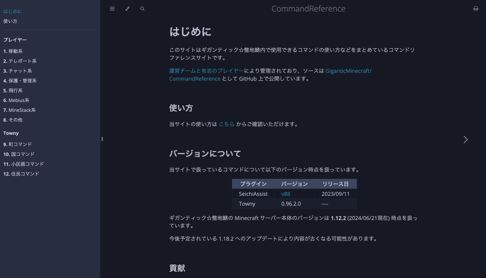

# 使い方

## サイドバー

画面左側に表示されているのはサイドバーです. そちらから閲覧したいリファレンスページを選びクリックすることでコマンド一覧が表示されます。

スマートフォンから閲覧している場合は画面左上に表示されているハンバーガーボタン[^1] (`≡`) をクリックすることでサイドバーが表示されます。

## 色を変更する

画面上部に表示されている筆ボタンからはテーマを変更できます。テーマを変更しても閲覧できる情報は何も変わらないので好きな色を選んでください。

## 検索する

画面上部に表示されている虫眼鏡ボタンから検索機能を使用できます。自分が求めているコマンドややりたいことを入力しページを探すことができます。

----

[^1]: [ふざけているわけではないです. 本当にそう言います](https://ja.wikipedia.org/wiki/ハンバーガーボタン)
